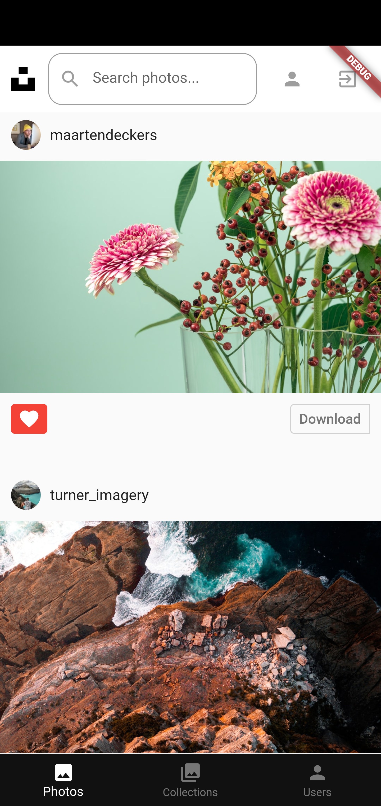
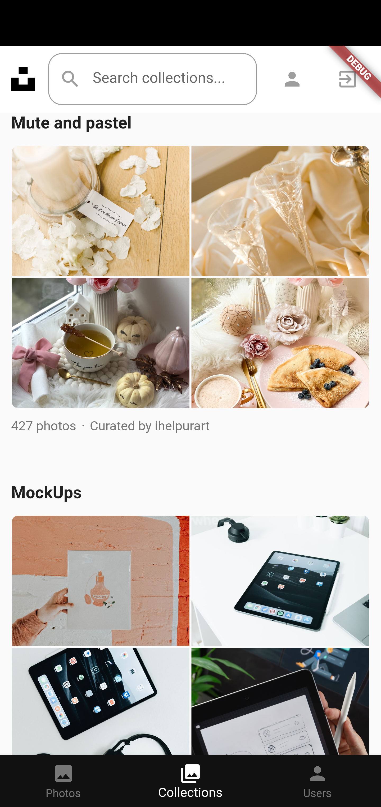
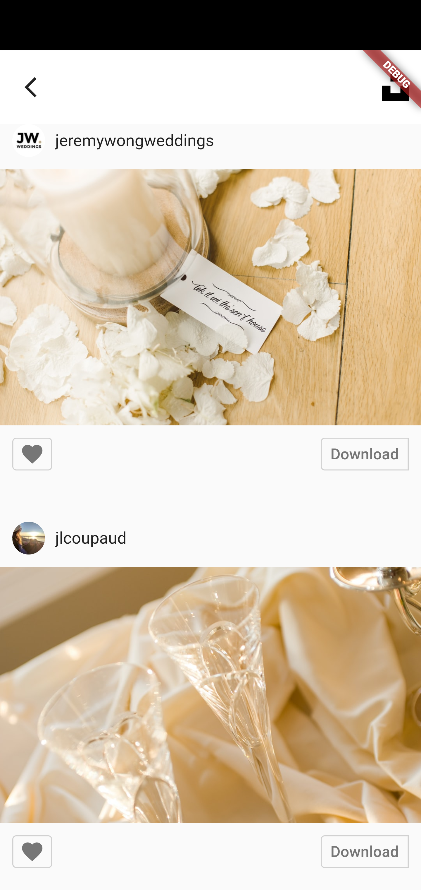
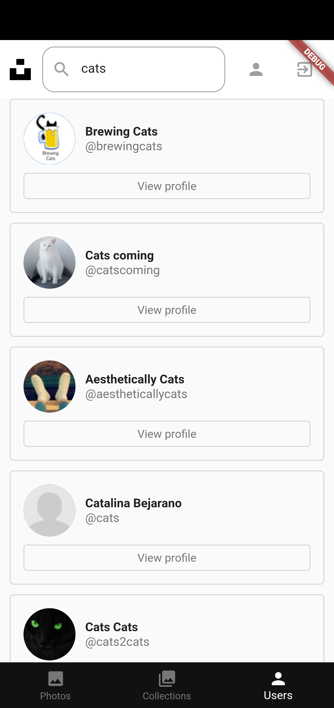
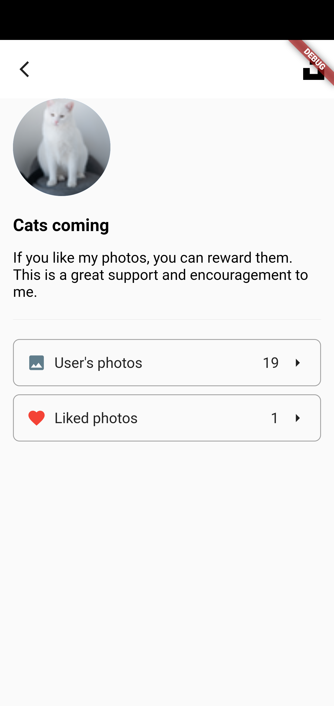
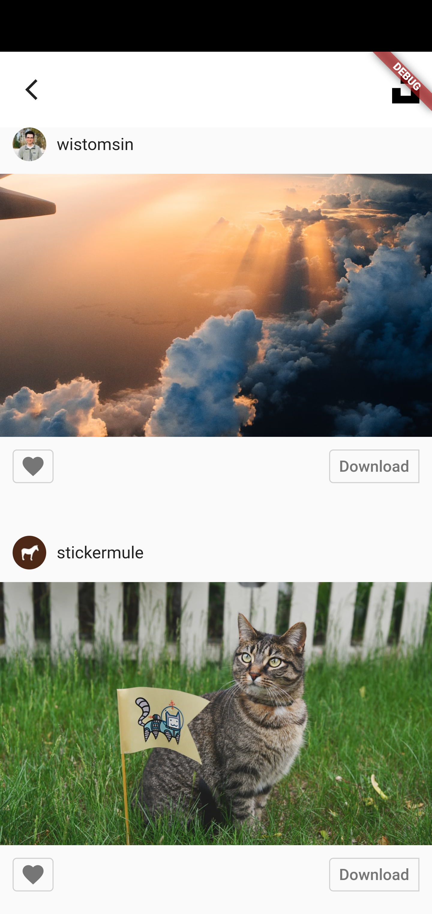

# Flutter Unsplash Photos App

App was written with using of Flutter Bloc Pattern and Unsplash Api.

## Screenshots from the program

Main screen where you can see popular photos

Screen where you can see popular collections and their photos by clicking on one of them

  
  

Screen where you can search users and see their profiles by clicking on button named "View profile"

  
  

Screens where you can see the user's photos and user's liked photos

  
  

